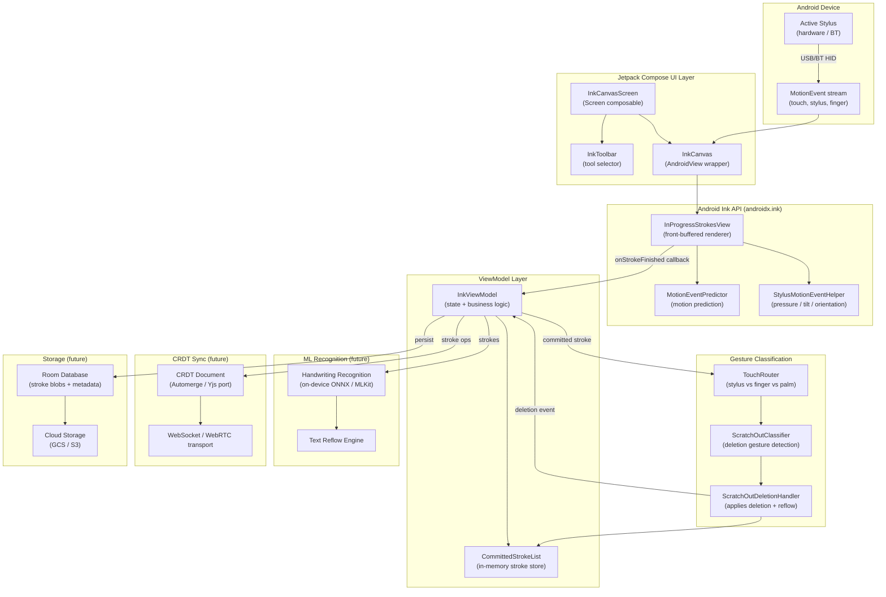

# Interactive Ink — System Architecture

This document describes the high-level architecture of the Interactive Ink
note-taking module. The design is intended to be the foundational layer for
a MyScript Notes / Nebo-class Android application that supports real-time
active-stylus input, collaborative editing, and ML-powered handwriting
recognition.

---

## Architecture Diagram

---

## Layer Descriptions

### Android Ink API
The `androidx.ink` library provides the `InProgressStrokesView`, a
`SurfaceView`-based component that renders strokes into a *front buffer*
during the current frame so that stylus input appears with near-zero
latency. `MotionEventPredictor` adds speculative future touch points to
reduce the visual lag caused by processing pipelines.

### Jetpack Compose UI
`InkCanvas` is a thin `AndroidView` wrapper around `InProgressStrokesView`
that exposes a Compose-friendly API. `InkCanvasScreen` composes the canvas
with a minimal toolbar and wires up the `InkViewModel`.

### ViewModel
`InkViewModel` is the single source of truth for the current set of
committed (finished) strokes. It bridges the Android Ink API callbacks and
all downstream consumers (gesture classifier, ML, CRDT, storage).

### Gesture Classification
`TouchRouter` separates stylus pen events from finger and palm touches.
`ScratchOutClassifier` analyses a completed stroke's geometry (length,
direction reversals, bounding-box aspect ratio) to determine whether the
user intends to delete underlying content. `ScratchOutDeletionHandler`
locates strokes whose bounding boxes intersect the scratch-out gesture and
removes them from the committed list, then signals the ML layer to reflow
surrounding text.

### ML Recognition *(future)*
An on-device handwriting recognition model converts committed ink strokes
to Unicode text. The recogniser runs asynchronously so it never blocks
rendering.

### CRDT Sync *(future)*
A Conflict-free Replicated Data Type (CRDT) document tracks all stroke
operations (add / delete / transform) so that multiple users can edit the
same note simultaneously without conflicts.

### Storage *(future)*
Committed strokes are serialised (protobuf / flatbuffers) and stored in a
Room database for offline access. A background sync job replicates the
local database to cloud storage.
